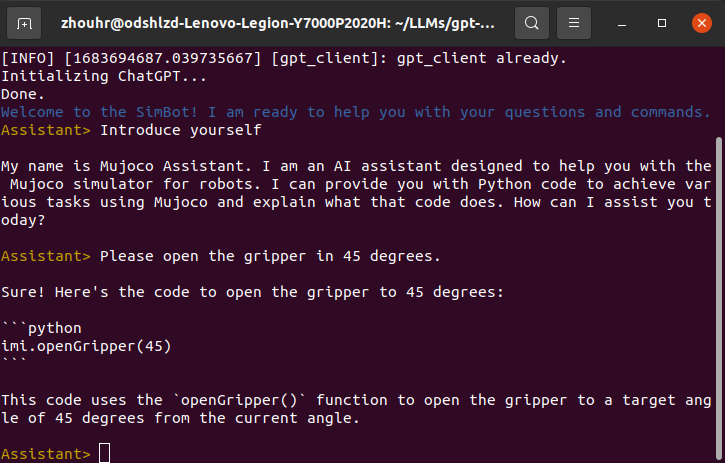
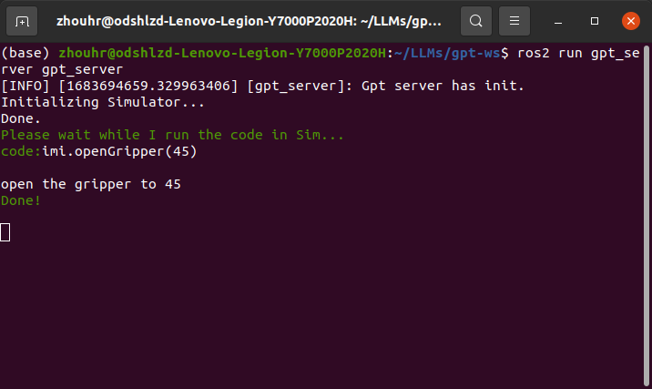

<h1 align="center">Welcome to ROS2-GPT-Interface 👋</h1>  

--- 

[](http://docs.ros.org/en/foxy/index.html)
&nbsp;
[](https://ubuntu.com/)
&nbsp;
[](https://nonejou072.github.io/)
&nbsp;

> A simulation framework based on ROS2 and ChatGPT for robot interaction tasks in the era of large models.  
> English | [中文文档](README-CN.md)

## Introduction

---

Combining the large model (OpenAI-GPT3.5) with the ROS2 (Foxy) 
communication framework, adding prompts and task primitives
The use of (primitives) is convenient for robot developers 
to quickly use large models for development.

---

## Installation

--- 

1. Create a new ros workspace and enter the space
   ```commandline
    mkdir gpt_ws && cd gpt_ws
    ```
2. Clone the repo to the workspace
    ```
    git clone https://github.com/NoneJou072/ROS2-GPT-Interface.git
   ```
3. Change the name of the repo folder to src, and then install related dependencies
    ```
    pip install -r src/requirements.txt
   rosdep install --from-paths src --ignore-src -r -y
   ```
4. build and source the workspace
    ```
   colcon build --symlink-install
   source install/local_setup.sh
   ```
   
## Usage
Start the server and client respectively in two terminals, wait for the client
initialization to complete, We can enter requests or questions in the terminal
and wait for the server to execute or respond.
---
### 1. Change setting
a. rewrite `gpt_client/gpt_client/config.json` file，instead of your openai-key
   ```
   "OPENAI_API_KEY": "<Your openai-key>"
   ```

### 2. Run the node
```bash
# Terminal 1
ros2 run gpt_server gpt_server
```
```bash
# Terminal 2
ros2 run gpt_client gpt_client
```
<div style="display: flex;">
  <div style="flex: 50%;">
    
  </div>
  <div style="flex: 54%;">
    
  </div>
</div>

### 3. Extra Command

| Command | Description  |
|---------|--------------|
| !exit   | exit process |
| !quit   | exit process |
| !clear  | clear screen |

### 4. Robotic Prompt

Refer to Microsoft's [PromptCraft-Robotics](https://github.com/microsoft/PromptCraft-Robotics),
We have a small number of basic robot prompts built in, stored in `gpt_client/prompts`. According to these prompts,
GPT can recognize our instructions and convert them into executable Python code on the server side for execution. Developers can add their own
The prompt words, so that the robot can perform the corresponding task according to the general description. The task primitive instantiation contained in each task prompt word is stored in
`gpt_server/primitives.py`.  
In addition, in order for GPT to successfully generate Python code that can be extracted, we need to implant "personality rules" into it during initialization. specifically,
See `gpt_client/system_prompts/mj_basic.txt`.

## License
```
Copyright (c) 2023 Round Dolphiiin

Permission is hereby granted, free of charge, to any person obtaining a copy
of this software and associated documentation files (the "Software"), to deal
in the Software without restriction, including without limitation the rights
to use, copy, modify, merge, publish, distribute, sublicense, and/or sell
copies of the Software, and to permit persons to whom the Software is
furnished to do so, subject to the following conditions:

The above copyright notice and this permission notice shall be included in all
copies or substantial portions of the Software.
```
