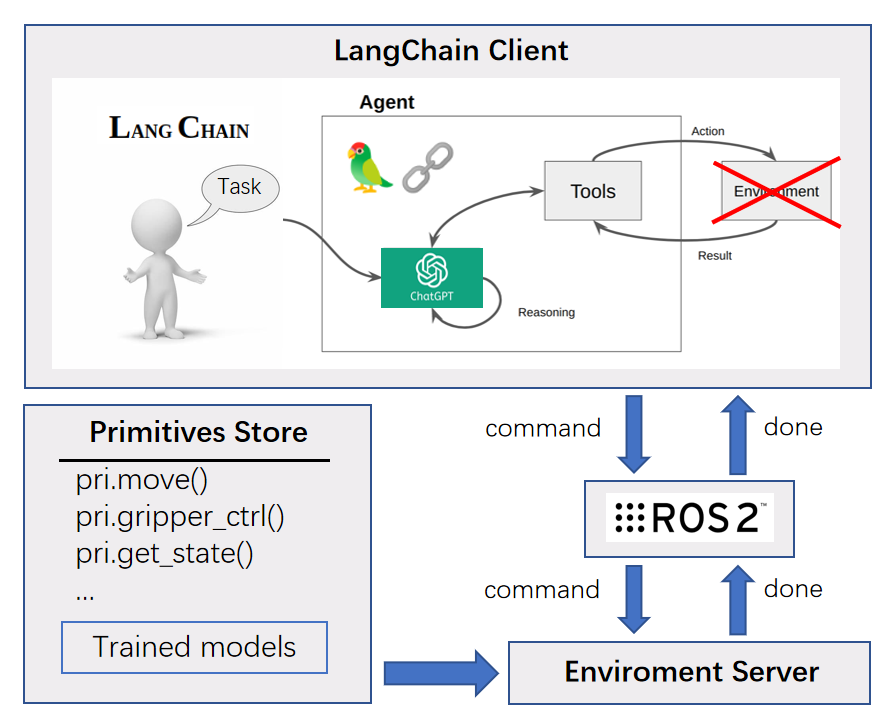
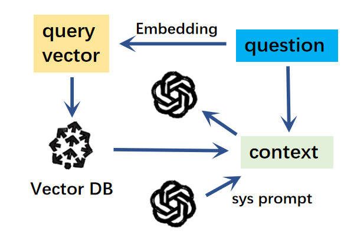

<h1 align="center">欢迎使用 robochain 👋</h1>  

--- 

[](http://docs.ros.org/en/foxy/index.html)
&nbsp;
[](https://ubuntu.com/)
&nbsp;
[](https://nonejou072.github.io/)
&nbsp;

> 结合通讯组件（ROS2/TCP）与 langchain 的仿真框架，通过使用大语言模型，能够使用自然语言对机器人进行控制。  
> [English](README-EN.md) | 中文文档

## 更新记录
* *2024/1/21* 更新至适配最新langchain版本，修复ros报错

## 简介

为了使用大语言模型对机器人下达指令，让机器人理解，自行生成任务代码并执行，一种方法是将大语言模型与ROS2通信框架结合。本项目使用了 langchain 与 ROS2（or TCP），基于提示工程对机器人操作方面的提示词内容进行了设计。
具体地，系统的运行流程为：
1. 初始化 langchain（包括 LLM、chain、tools）、ros/tcp、仿真环境
2. 在客户端内输入一个请求，发送到 chain 内
3. 在 chain 内，使用 tools 对该请求进行文本预处理操作
4. 把处理后的请求发送给大语言模型，获得回答
5. 把回答发送到服务端
6. 在服务端内提取出回答内包含的可执行代码片段，并执行
7. 执行结果作为响应回传到客户端中

针对在线部署和离线部署，分别提供了不同的选择：

|          -           |         online         |                   offline                   |
|:--------------------:|:----------------------:|:-------------------------------------------:|
| Large Language Model |        gpt-3.5         |          others(from Huggingface)           |
|   Embedding Model    | OpenAI-Embedding-Model | all_datasets_v4_MiniLM-L6(from Huggingface) |
|    Vector Store      |        Pinecone        |                   Chroma                    |

## 部署

**环境准备：**  
>Ubuntu-20.04+ / Windows  
ROS2(optional)  
Python 3.8+  
langchain  
robopal(optional but recommended)

**使用 ROS 进行通讯的部署流程：**
1. 新建 ros 工作空间并进入空间中
   ```commandline
    mkdir gpt_ws && cd gpt_ws
    ```
2. 克隆本仓库到工作空间
    ```
    git clone https://github.com/NoneJou072/robochain.git
    (optional) mv robochain src
   ```
3. 安装相关依赖
    ```
    pip install -r src/requirements.txt
    rosdep install --from-paths src --ignore-src -r -y
   ```
4. 编译，排查报错
    ```
   colcon build --symlink-install
   ```
**使用 TCP 进行通讯的部署流程：**

0. (建议)新建 conda 环境
    ```
    conda create -n robochain python=3.11
    ```
1. 克隆本仓库到本地
    ```
    git clone https://github.com/NoneJou072/robochain.git
    ```
2. 安装相关依赖

## 使用

---
### 0. (可选)添加密钥
如果使用在线的大语言模型或向量数据库，如 ChatGPT、Pinecone 等，需要
添加 `gpt_client/gpt_client/commons/config.json` 文件内的密钥
   ```
   "OPENAI_API_KEY": "<Your openai-key>"
   "PINECONE_API_KEY": "<Your pinecone-key>"
   ```
[pinecone](https://www.pinecone.io/) 是一个在线的向量数据库，如果有需要请自行注册

### 2. 运行
**A. 使用 ROS2 进行通讯**

分别在两个终端中启动 llm 服务端和 robot 客户端，等待初始化完成后，
我们可以在终端内输入请求或问题，等待服务端执行或回应。
```bash
# Terminal 1
ros2 run gpt_server gpt_server
```
```bash
# Terminal 2
ros2 run gpt_client gpt_client
```
**B. 使用 TCP 进行通讯**

在 Pycharm 中直接运行脚本即可，例如 `gpt_client/gpt_client/examples/client_tcp_***.py` .

### 3. 仿真环境与提示词示例
> 默认使用 [robopal](https://github.com/NoneJou072/robopal) 机器人操作框架中的环境。如果需要使用其他环境，可以将 `gpt_server/gpt_server/demo_env.py` 中的环境类修改为其它的机器人环境

**示例命令**  
部署成功后，可以尝试在客户端中输入以下示例内容，看看返回的内容。

场景一: 物体抓取
  * `pick up the red block`- 抓取红色方块
  * `put it down 10cm to the front of the white block.`- 把它放到白色方块前方10cm的位置

**系统指令**  
在聊天框中输入以下指令，可以执行对应的动作。

| 命令     | 描述   |
|--------|------|
| !exit  | 退出进程 |
| !quit  | 退出进程 |
| !clear | 清屏   |

### 4. 提示工程
参考 Microsoft 的 [PromptCraft-Robotics](https://github.com/microsoft/PromptCraft-Robotics)，我们编写了一些用于机器人操作场景的提示词，这些提示词存放在 `gpt_client/prompts` 中，分为四个文本：
1. primitives - 技能原语提示词
2. scene - 任务场景提示词
3. task_settings - 任务要求提示词
4. system - 系统提示词

通过 langchain 提供的 prompt template 将这些文本以及我们的输入文本串联成一个提示词模板，方便大语言模型的理解。



另外，可以使用一些工具对上面的提示词进行处理。例如使用 `memory` 工具将过去的 QA 存放到提示词模板中，让大语言模型能够记忆上下文内容。但是这样会造成 token 的用量越来越多，使模型回应的速度变慢或消耗更多的金钱。

因此，更推荐 `retriever` 工具，即使用向量数据库索引，进行输入文本的相似度匹配，并可以减少冗余提示词造成的影响。



上面两种提到的示例可以在示例代码中切换。

根据这些提示词，LLM 能识别我们的指令，并在服务端中转换成可以被执行的 Python 代码进行执行。我们可以修改或添加提示词，让机器人能够根据自然语言的输入执行相应的任务。

## 问题
### 1. 网络代理报错
在使用OpenAI的接口时，可能会发生如下报错：
`pydantic.v1.error_wrappers.ValidationError: 1 validation error for ChatOpenAI
__root__
  Unknown scheme for proxy URL URL('socks://127.0.0.1:7891/') (type=value_error)`

解决方法：
查看自己的代理设置，并禁用掉以 socks 开头的代理
```bash 
env | grep -i proxy
unset all_proxy
unset ALL_PROXY
``` 

## Star History

[](https://star-history.com/#NONEJOU072/robochain&Date)


## License

```
Copyright (c) 2023 Round Dolphiiin

Permission is hereby granted, free of charge, to any person obtaining a copy
of this software and associated documentation files (the "Software"), to deal
in the Software without restriction, including without limitation the rights
to use, copy, modify, merge, publish, distribute, sublicense, and/or sell
copies of the Software, and to permit persons to whom the Software is
furnished to do so, subject to the following conditions:

The above copyright notice and this permission notice shall be included in all
copies or substantial portions of the Software.
```
